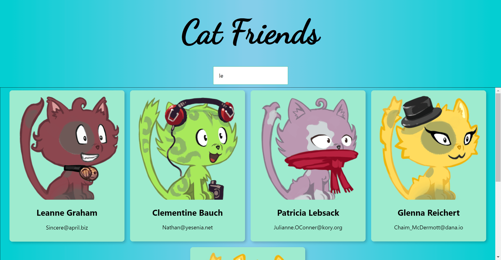

# Cat Friends

[View Live Site](https://cat-friends-benz.netlify.app/)

My first React website taught by Andrei in his [Udemy Senior Web Developer Course](https://www.udemy.com/course/the-complete-junior-to-senior-web-developer-roadmap/).
This project was bootstrapped with [Create React App](https://github.com/facebook/create-react-app).

## Preview

## To run this project

1. Clone this repository and cd into it
2. Run `npm install`
3. Run `npm run start`

## Built with

- [React](https://reactjs.org/)
- [Redux Core](https://react-redux.js.org/)
- [Redux Thunk](https://github.com/reduxjs/redux-thunk)
- [Tachyons](https://tachyons.io/)

## Update

- Added basic Unit Testing with [Jest](https://jestjs.io/)
- Added basic [Typescript](https://www.typescriptlang.org/)

## Show your support

Give a ⭐️ if you like this project!

## License

[MIT](LICENSE)
